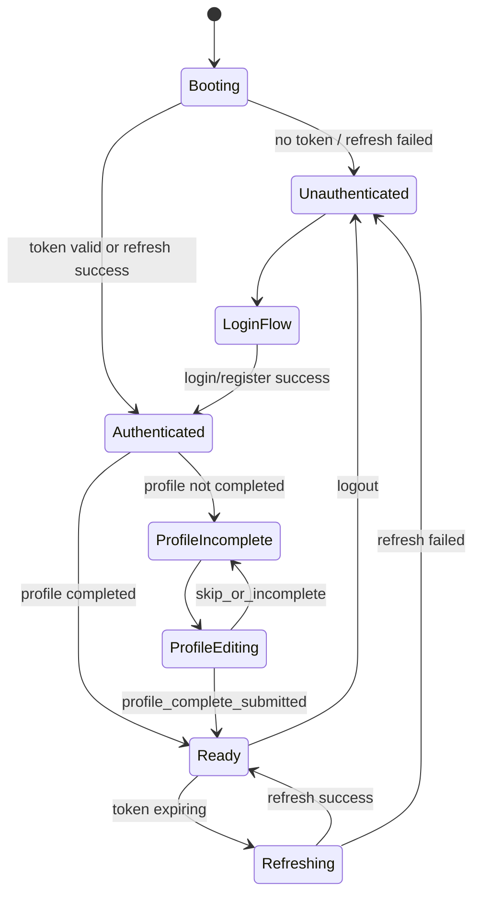
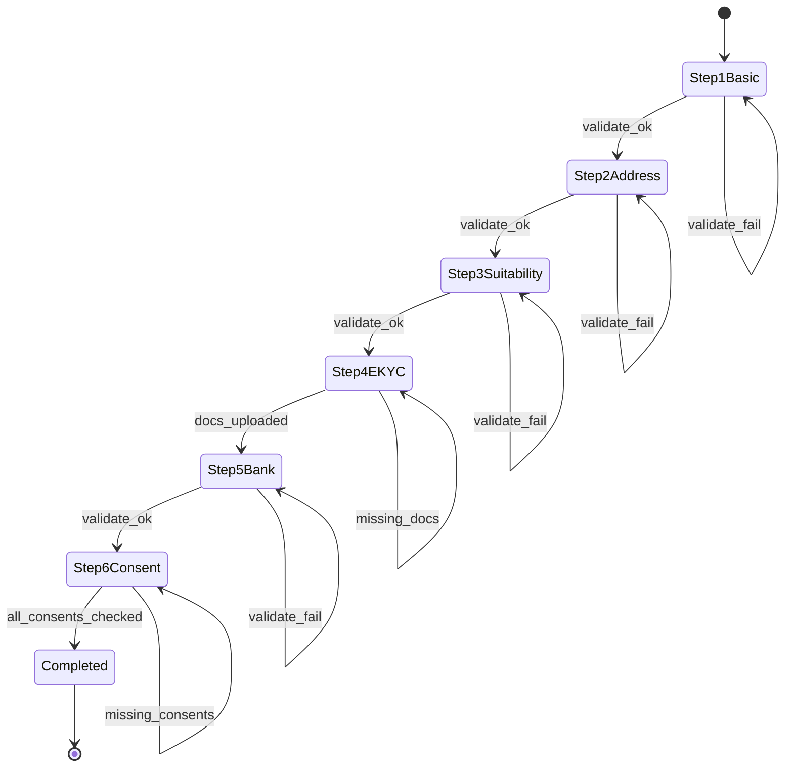
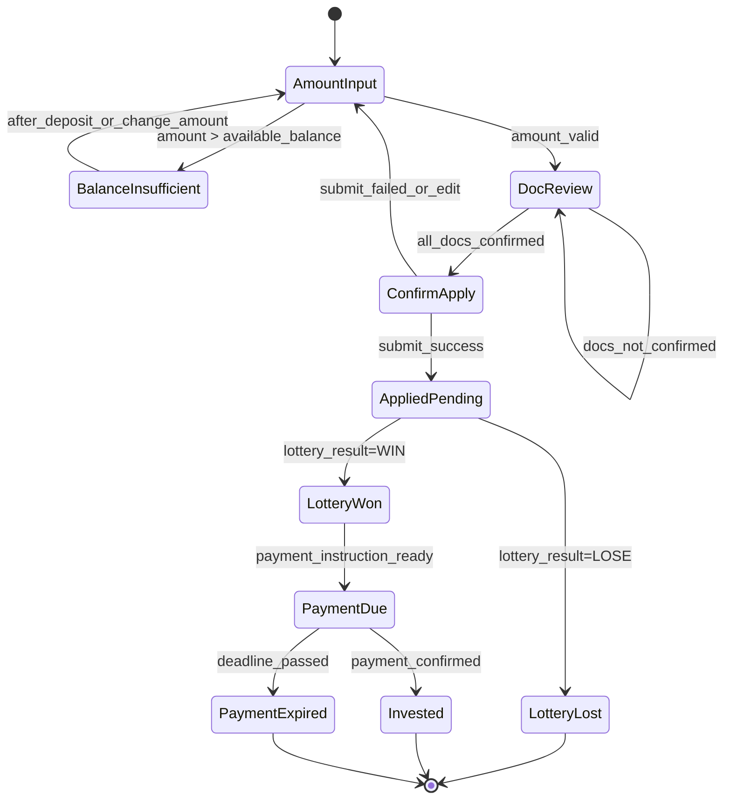
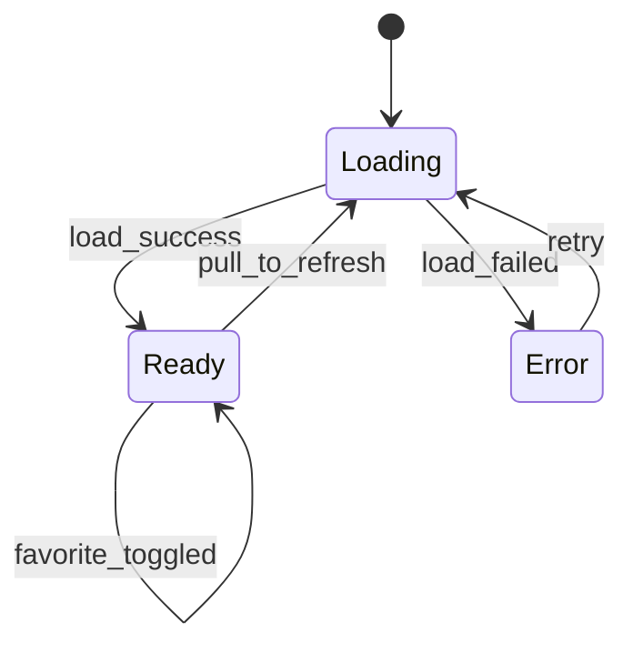

# FUNDEX Demo -> Flutter 实施文档（页面清单 + 状态机 + API 字段草案）

## 1. 文档目标

本文件将 [index.html](/Users/aaronhou/Documents/GitHub/HanjouFinace/fundex/docs/index.html) 的演示流程拆解为可落地的 Flutter 实施方案，输出三件事：

1. Flutter 页面清单（含路由映射与当前工程对应关系）
2. 关键业务状态机（可直接转为状态管理实现）
3. API 字段草案（Swagger-first；最终字段和响应结构以项目 Swagger 为准）

约束来源：

- Funding Swagger UI: `https://sit-admin.gutingjun.com/api/swagger-ui.html#/`
- Funding OpenAPI: `https://sit-admin.gutingjun.com/api/crowdfunding/v2/api-docs`
- 规则文档：[api_source_of_truth.md](/Users/aaronhou/Documents/GitHub/HanjouFinace/fundex/docs/api_source_of_truth.md)
- 现有路由：[app_router.dart](/Users/aaronhou/Documents/GitHub/HanjouFinace/fundex/lib/app/router/app_router.dart)
- 现有认证 API 常量：[api_paths.dart](/Users/aaronhou/Documents/GitHub/HanjouFinace/fundex/lib/app/config/api_paths.dart)

## 2. Flutter 页面清单

### 2.1 页面与路由映射（Demo -> Flutter）

| Demo 页面 ID | 页面语义 | 目标 Flutter 路由 | 目标页面（建议） | 当前工程映射 | 数据来源 |
| --- | --- | --- | --- | --- | --- |
| `p-splash` | 启动页 | `/splash` | `SplashPage` | 已有 | 本地 session + refresh |
| `p-login` | 登录入口（邮箱/手机号） | `/login`, `/login/mobile`, `/login/email` | `AuthEntryPage` + method pages | 已有 | `off-rest` + `user-rest` |
| `p-reg` | 快速注册 | `/register`, `/register/mobile`, `/register/email` | `RegisterEntryPage` + method pages | 已有 | `user-rest` |
| `p-complete` | 资料完善（6步） | `/member-profile/onboarding`, `/member-profile/edit` | `MemberProfileIntakePage`（扩展为 6 步） | 已有 3 步版本 | `user-rest` + `off-rest` + eKYC |
| `p-home` | 首页总览 | `/home` | `HomeOverviewTabPage` | 已有（静态） | fund summary + pending + cooldown |
| `p-list` | 基金列表 | `/funds` | `FundListPage`（新增） | 当前 `investment` tab 占位 | funding fund APIs |
| `p-detail` | 基金详情 | `/funds/:fundId` | `FundDetailPage`（新增） | 无 | funding fund APIs |
| `p-invest` | 抽选申购流程 | `/funds/:fundId/apply` | `FundLotteryApplyPage`（新增） | 无 | apply + docs + result + deposit |
| `p-dep` | 入金 | `/wallet/deposit` | `DepositPage`（新增） | 无 | wallet APIs |
| `p-wit` | 出金 | `/wallet/withdraw` | `WithdrawPage`（新增） | 无 | wallet APIs |
| `p-hist` | 交易历史 | `/wallet/history` | `TransactionHistoryPage`（新增） | 无 | wallet/history APIs |
| `p-mypage` | 我的资产中心 | `/profile` | `ProfileCenterTabPage`（重构为资产中心） | 已有 | profile + wallet + holding |
| `p-kz` | KIZUNARK 社区 | `/discussion-board` | `DiscussionBoardTabPage`（重构） | 已有占位 | community APIs |
| `p-notif` | 通知中心 | `/notifications` | `NotificationPage`（新增） | 无 | notification APIs |
| `p-set` | 设置菜单 | `/settings` | `SettingsPage`（新增） | 目前并入 `/profile` | account/settings APIs |

### 2.2 Tab 壳层重构建议

现状 `StatefulShellRoute` 分支是 `/home`, `/hotel-booking`, `/investment`, `/discussion-board`, `/profile`。

建议改为 Demo 对齐壳层：

1. `/home`
2. `/funds`
3. `/discussion-board`（KIZUNARK）
4. `/profile`（资产中心）
5. `/settings`

`/hotel-booking` 可保留为独立业务入口，不占主底部 Tab。

## 3. 状态机

### 3.1 App 会话与路由守卫状态机

落地点：

- 当前 `resolveAuthRedirect` 已覆盖 `loading/auth/no-auth` 基础跳转。
- 需追加 profile completion guard 到投资相关路由（`/funds/:id/apply` 等）。

### 3.2 资料完善（6步）状态机

落地点：

- 现有 [member_profile_intake_page.dart](/Users/aaronhou/Documents/GitHub/HanjouFinace/fundex/lib/features/member_profile/presentation/pages/member_profile_intake_page.dart) 为 3 步，需要扩展为 6 步并拆分子组件。
- `allowSkip` 仅在 onboarding 模式可用，edit 模式不可跳过关键合规项。

### 3.3 抽选申购状态机

落地点：

- 建议建立 `InvestmentApplicationState`（freezed union）驱动页面步骤，而不是页面内索引变量。
- 通知页点击“抽选结果”直接跳 `PaymentDue` 对应详情。

### 3.4 基金列表筛选状态机

## 4. API 字段草案（Swagger-first）

说明：

- 本节是 UI 反推的数据契约草案，不是最终接口定义。
- 真实路径、字段名、必填性、枚举值以 Swagger 为准。
- 已在工程中落地的接口常量以 [api_paths.dart](/Users/aaronhou/Documents/GitHub/HanjouFinace/fundex/lib/app/config/api_paths.dart) 为基线。

### 4.1 通用响应与错误模型草案

| 模型 | 字段草案 | 说明 |
| --- | --- | --- |
| `ApiEnvelope<T>` | `code:int`, `msg:string`, `data:T` | 兼容当前 funding 返回包裹结构 |
| `ApiError` | `code`, `msg`, `details?`, `traceId?` | 统一错误映射到 Failure/UI message |
| `Paged<T>` | `items:T[]`, `page`, `pageSize`, `total` | 列表类接口（若 Swagger 使用分页） |

### 4.2 认证与会话（已知接口 + 草案字段）

| 能力 | 当前路径（若已知） | 请求字段草案 | 响应字段草案 | 已有 DTO |
| --- | --- | --- | --- | --- |
| 发送登录验证码（邮箱） | `GET /member/user/emailLoginCode` | `email` | `data: bool` | n/a |
| 发送登录验证码（手机） | `GET /mss/smsCode` | `mobile`, `biz`, `secret` | `data: bool` | n/a |
| 发送注册验证码（邮箱） | `GET /member/user/createRegisterEmailCode` | `email` | `data: bool` | n/a |
| 发送注册验证码（手机） | `GET /member/user/createRegisterMobileCode` | `mobile`, `biz`, `secret` | `data: bool` | n/a |
| 注册提交 | `POST /member/user/registerApply` | `type`, `email/mobile`, `code`, `intlTelCode`, `contact?` | `data: bool` | n/a |
| 登录换 token | `POST /uaa/oauth/token` | `username`, `password`, `grant_type`, `auth_type`, `scope`, `code?` | `access_token`, `refresh_token`, `expires_in`, `userId`, `memberLevel` | `AuthSessionDto`, `AuthUserDto` |
| 刷新 token | `POST /uaa/oauth/token` | `grant_type=refresh_token`, `refresh_token` | 同上 | `AuthSessionDto` |
| 获取当前用户 | `GET /crowdfunding/user/index` | bearer token | 见 `AuthUserDto` 字段 | `AuthUserDto` |
| 登出 | `DELETE /uaa/oauth/token` | `accessToken` | no content / success envelope | n/a |

### 4.3 资料完善（6步）能力与字段草案

Swagger 绑定原则：优先 `user-rest` / `off-rest`，按 operationId 绑定，不先假定旧工程路径。

| 步骤能力 | Swagger 绑定（待确认） | 请求字段草案 | 响应字段草案 |
| --- | --- | --- | --- |
| Step1 基础信息保存 | `user-rest` 更新用户基础信息类 operation | `firstName`, `lastName`, `katakana`, `birthday`, `intlTelCode`, `phone` | `profileStatus`, `updatedAt` |
| Step2 地址保存 | `user-rest` 地址更新类 operation | `zipCode`, `prefecture`, `city`, `addressLine1`, `addressLine2?` | `profileStatus`, `updatedAt` |
| Step3 适当性问卷保存 | `off-rest`/`user-rest` 适当性类 operation | `occupation`, `annualIncomeRange`, `financialAssetRange`, `investmentExperiences[]`, `investmentPurpose`, `fundSourceType`, `riskTolerance` | `suitabilityScore?`, `profileStatus` |
| Step4 eKYC 上传 | `off-rest` eKYC/upload 类 operation | `documentType`, `frontImageUrl`, `backImageUrl`, `selfieImageUrl`, `providerTraceId?` | `ekycStatus`, `reviewStatus`, `rejectionReason?` |
| Step5 银行卡绑定 | `user-rest` 银行卡 operation | `bankCode`, `bankName`, `branchCode`, `branchName`, `accountType`, `accountNumber`, `accountHolderKana` | `bankAccountId`, `bindStatus` |
| Step6 同意事项提交 | `off-rest` agreement/consent 类 operation | `consentElectronicDelivery`, `consentAntiSocial`, `consentPrivacy`, `consentAt`, `versionMap` | `consentStatus`, `profileCompleted=true/false` |

### 4.4 基金列表/详情字段草案

| 模型 | 字段草案（Swagger 命名可不同） | 对应页面 |
| --- | --- | --- |
| `FundSummary` | `fundId`, `volNo`, `name`, `city`, `status(open/soon/active/done)`, `fundraisingMethod(lottery/first-come)`, `annualYield`, `durationMonths`, `totalAmount`, `appliedAmount`, `progressRate`, `tags[]`, `isFavorite`, `heroImageUrl` | 列表、首页卡片 |
| `FundDetail` | `fundId`, `name`, `description`, `annualYield`, `yieldDisclaimer`, `durationMonths`, `totalAmount`, `minInvestmentAmount`, `distributionRule`, `lotteryDate`, `propertyInfo{location,type,structure,builtAt}`, `priorityStructure{investorRatio,operatorRatio}`, `riskItems[]`, `contractOverview{contractType,fundPeriod,coolingOffDays}`, `fees[]`, `operatorInfo{companyName,licenseNo,address}` | 详情页 |
| `FundFavoriteState` | `fundId`, `isFavorite` | 列表/详情收藏 |

### 4.5 抽选申购与结果字段草案

| 能力 | Swagger 绑定（待确认） | 请求字段草案 | 响应字段草案 |
| --- | --- | --- | --- |
| 查询可投余额 | wallet/balance operation | - | `availableBalance`, `lockedBalance`, `currency` |
| 获取申购文件清单 | fund docs operation | `fundId` | `docs[{docId,type,title,version,url,required}]` |
| 提交抽选申购 | apply operation | `fundId`, `applyAmount`, `units`, `agreedDocIds[]`, `agreedRisk=true` | `applicationId`, `status=PENDING_LOTTERY`, `lotteryDate` |
| 查询抽选结果 | lottery result operation | `applicationId` | `lotteryStatus(PENDING/WON/LOST)`, `announcedAt` |
| 获取中签入金指引 | payment instruction operation | `applicationId` | `deadlineAt`, `bankInfo{bank,branch,accountNo,accountName}`, `requiredAmount` |
| 确认已入金 | payment confirm operation | `applicationId`, `proof?` | `status=PAID/VERIFIED`, `investmentId` |

### 4.6 钱包/交易/通知字段草案

| 领域 | 字段草案 |
| --- | --- |
| 入金信息 | `depositAccount{bankName,branchName,accountType,accountNumber,accountName}`, `copyToken?` |
| 出金申请 | `withdrawAmount`, `fee`, `arrivalEstimateAt`, `bankAccountId` |
| 交易流水 | `txId`, `txType(INVEST/DIVIDEND/REDEEM/DEPOSIT/WITHDRAW/FEE/TAX)`, `amount`, `direction(IN/OUT)`, `fundId?`, `fundName?`, `occurredAt`, `status`, `note` |
| 通知 | `noticeId`, `type(LOTTERY_RESULT/DIVIDEND/SYSTEM)`, `title`, `content`, `bizId`, `bizRoute`, `isRead`, `createdAt` |

### 4.7 KIZUNARK 字段草案

| 能力 | 字段草案 |
| --- | --- |
| 帖子列表 | `postId`, `authorMaskedName`, `authorLevel`, `content`, `fundRef{fundId,fundName}?`, `quotedPostId?`, `commentCount`, `createdAt`, `canComment` |
| 发帖 | `content`, `fundId?`, `quotedPostId?` |
| 评论列表/新增 | `commentId`, `postId`, `authorMaskedName`, `content`, `quotedCommentId?`, `createdAt` |
| 权限 | `isInvestor`（非投资人仅可读） |

## 5. 数据模型与代码落地建议

### 5.1 DTO/Entity 新增建议

建议新增（名称可按代码规范调整）：

1. `FundSummaryDto` / `FundSummary`
2. `FundDetailDto` / `FundDetail`
3. `InvestmentApplicationDto` / `InvestmentApplication`
4. `LotteryResultDto` / `LotteryResult`
5. `WalletBalanceDto` / `WalletBalance`
6. `TransactionItemDto` / `TransactionItem`
7. `NotificationItemDto` / `NotificationItem`
8. `KizunarkPostDto` / `KizunarkPost`
9. `KizunarkCommentDto` / `KizunarkComment`

### 5.2 现有模型复用

- 认证会话复用 `AuthSessionDto`
- 当前用户复用 `AuthUserDto`
- 资料完善可升级 `MemberProfileDetailsDto`（当前为本地存储模型）为“本地草稿 + 远端快照”双模型

## 6. 分阶段实施建议

1. 路由与壳层重构：补 `/funds`、`/settings`、`/notifications`，保留现有 auth/profile 路由。
2. 基金列表/详情：先打通只读链路（列表 -> 详情）。
3. 抽选申购：接入金额校验、文档确认、申购提交、结果查询。
4. 资料完善 6 步：从现有 3 步扩展，接入真实保存与状态回填。
5. 钱包与交易：入金信息、出金申请、流水列表。
6. KIZUNARK 与通知：帖子/评论、通知跳转申购状态页。

## 7. Swagger 对齐清单（执行前必须完成）

1. 为每个“待确认”能力绑定明确 `tag + operationId`。
2. 确认请求参数位置（query/body/form-data）和鉴权方式。
3. 确认金额字段单位（元/分）与小数精度。
4. 确认时间字段时区（建议统一 UTC，展示转 JST）。
5. 把差异样例补充到 [README_API.md](/Users/aaronhou/Documents/GitHub/HanjouFinace/fundex/README_API.md)。

